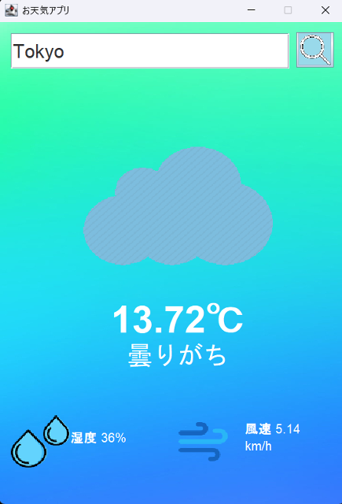

# お天気アプリ Java版
Java Swingを使用して作成したシンプルなデスクトップ用リアルタイムお天気アプリです。

ユーザーが地名を入力すると、OpenWeatherMap APIから最新の天気データを取得し、**気温・湿度・風速・天気の状態**を表示します。

---



## 概要
- **ローマ字で地名を入力して天気を検索**
- **気温・湿度・風速を表示**
- **天候に応じたアイコンを表示**
- **日本語表示対応**
---

## 🛠️ 動作環境
- **JDK:** Java 23 (Java 11以上)
- **GUI:** Java Swing
- **API:** OpenWeatherMap API
- **ライブラリ:** `JSON.simple`
---

## 🌐 APIキーを設定
このアプリを実行するには、**OpenWeatherMap APIキー** が必要です。

1. [OpenWeatherMapのAPIキー取得ページ](https://home.openweathermap.org/api_keys)から無料のAPIキーを取得
2. `WeatherApp.java` の `API_KEY` に設定

```java
private static final String API_KEY = "あなたのAPIキー";
```

## 🚀 実行方法

1. **Javaをインストール**
   
   Java Development Kit(JDK)をインストールしてください。
   
   (最新版のJDKを推奨)

2. **リポジトリのクローン(ダウンロード)**
   
   ターミナルまたはコマンドプロンプトで以下を実行:
   ```sh
   git clone https://github.com/motomasMINO/WeatherApp-Java.git

   cd WeatherApp-Java
3. **アプリ起動**
   ```sh
   java -cp "out;lib/*" App
   ```
   ✅ Mac/Linux の場合: out;lib/* → "out:lib/*" に変更
## 📜 ライセンス

このプロジェクトはMIT Licenseのもとで公開されています。

## 📧 お問い合わせ

- **GitHub: motomasMINO**

- **Email: yu120615@gmail.com**

  バグ報告や改善点・機能追加の提案はPull RequestまたはIssueで受け付けています!
